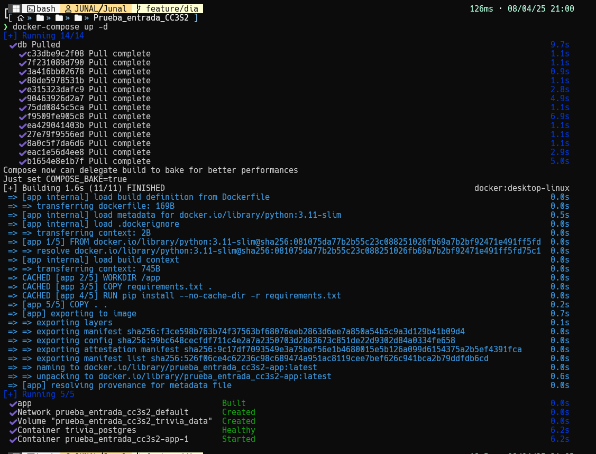
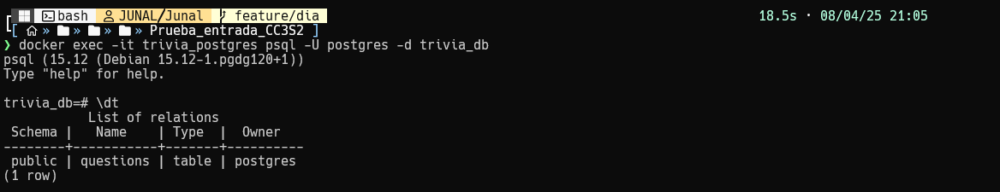
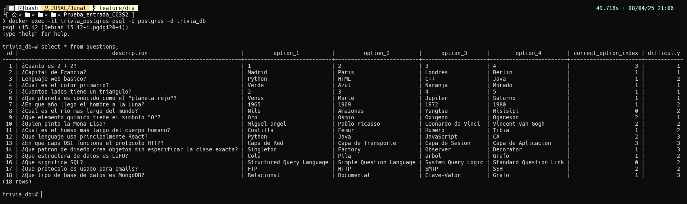

# Evidencia Técnica - Día 1

## Verificación del Contenedor PostgreSQL

### 1. Configuración e Inicialización
**Construcción y despliegue del contenedor:**
```bash
# Desde el directorio que contiene docker-compose.yml
docker-compose up -d --build
```



**Verificación del estado del contenedor:**
```bash
docker ps -f name=trivia_postgres
```

### 2. Conexión a la Base de Datos
**Acceso interactivo a PostgreSQL:**
```bash
docker exec -it trivia_postgres psql -U postgres -d trivia_db
```

### 3. Verificación de Estructura de Datos
**Listado de tablas disponibles:**
```sql
\dt
```
*Salida esperada:*
```
        List of relations
 Schema |   Name    | Type  |  Owner   
--------+-----------+-------+----------
 public | questions | table | postgres

```

**Consulta de datos de ejemplo:**
```sql
SELECT * FROM questions;
```
*Salida esperada:*


# Evidencia Tecnica - Dia 3

### 1. Inicializacion
```bash
# Desde el directorio que contiene docker-compose.yml
docker-compose up -d --build
```


### 2. Verificacion 
